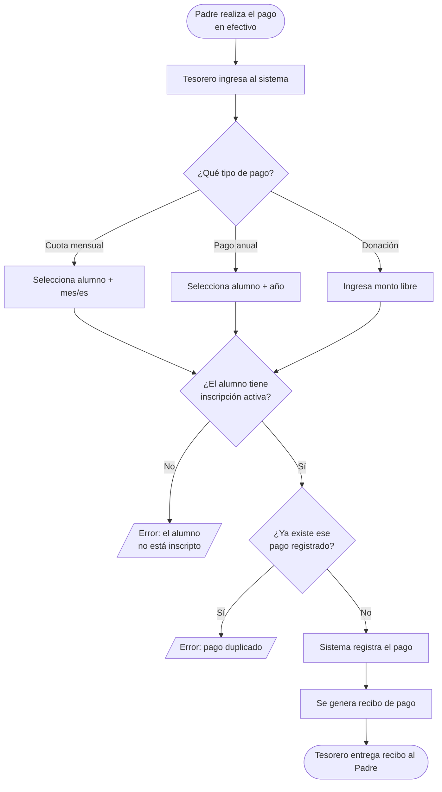
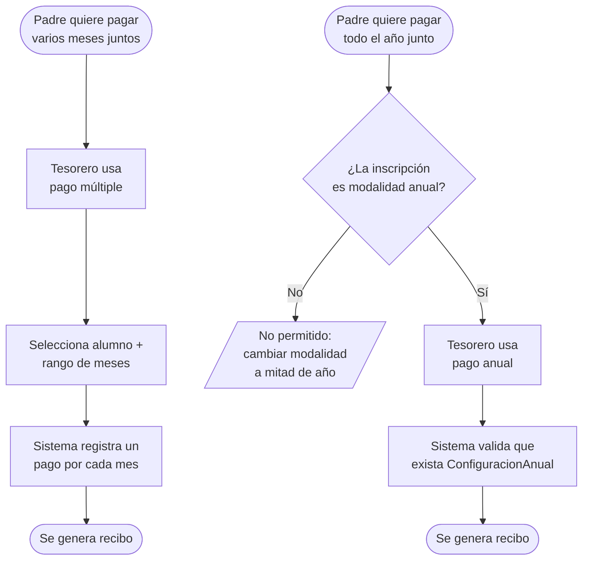
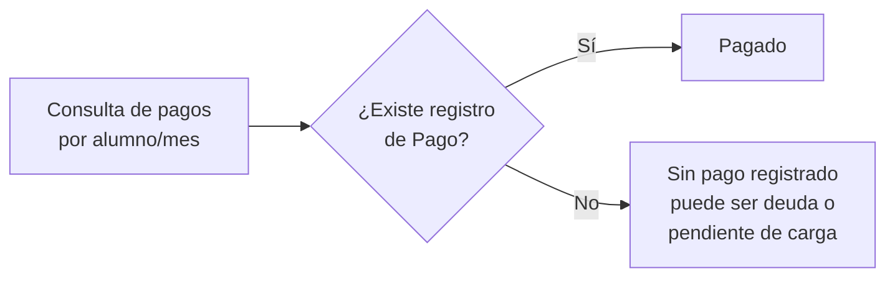

# Flujo de Pagos

## Actores
- **Padre/Socio**: realiza el pago en efectivo al Tesorero
- **Tesorero**: carga el pago en el sistema y entrega el recibo

---

> **Para visualizar los diagramas:** abrí el archivo `.mmd` correspondiente, seleccioná todo (Ctrl+A), copiá (Ctrl+C) y pegá en [mermaid.live](https://mermaid.live).
>
> | Diagrama | Archivo |
> |---|---|
> | Flujo principal | `pagos_flujo_principal.mmd` |
> | Casos especiales | `pagos_casos_especiales.mmd` |
> | Estado de deuda | `pagos_estado_deuda.mmd` |

---

## Flujo principal

---

## Casos especiales

---

## Estado de deuda de un alumno

Un alumno figura como **deudor** cuando no existe registro de pago en la base de datos para un mes determinado. No hay un campo "debe" — la ausencia del registro es la deuda.

